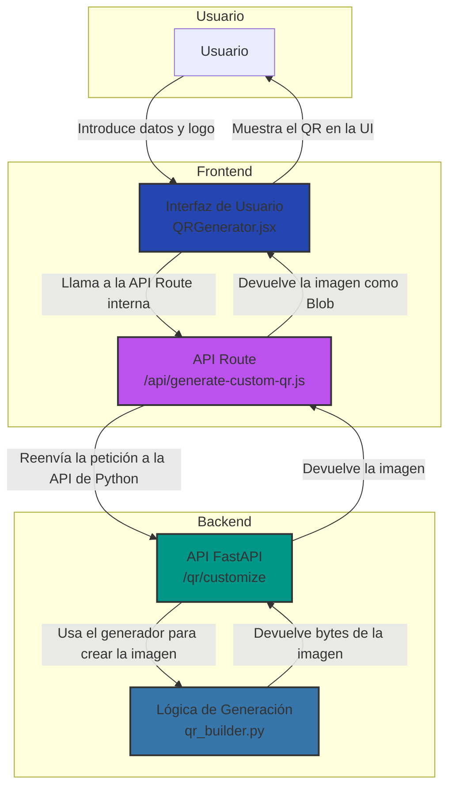
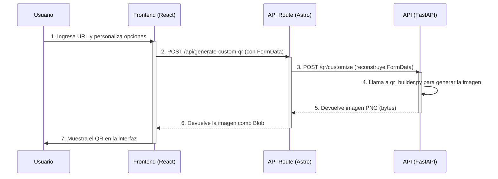

<div align="center">
  
  <h1>QR Custom Generator</h1>
  
  <a href="https://qr-custom-generator.vercel.app/" target="_blank">
    
  </a>
  
  <br><br>
  
  
  
  
  
</div>

<br>

<div align="center">
  
</div>

<br>

## 🌟 **¿Qué es QR Custom Generator?**

**QR Custom Generator** es una aplicación web full-stack diseñada para desarrolladores, diseñadores y empresas que buscan **personalización total** sin comprometer la **privacidad** de sus datos.

> 💡 **Diferencial clave**: Todos los QRs se generan del lado del servidor sin almacenar información del usuario.

---

---

## 🎯 Características Principales

*   **Generación Instantánea**: Convierte cualquier texto o URL en un código QR al instante.
*   **Personalización de Colores**: Elige el color principal y el de fondo con un selector visual.
*   **Análisis de Contraste en Tiempo Real**: La herramienta calcula y muestra el ratio de contraste según las directrices de accesibilidad (WCAG), asegurando la legibilidad de tus QRs.
*   **Logotipo Personalizado**: Sube tu propio logo en formato PNG o JPG para que aparezca en el centro del QR. La API ajusta automáticamente el nivel de corrección de errores para mantener la funcionalidad.
*   **Ajustes de Diseño**: Controla el tamaño de los módulos del QR y el espaciado del borde.
*   **Marco Visual**: Ajusta el contraste del marco de previsualización para ver cómo quedaría tu QR sobre fondos claros u oscuros.
*   **Descarga y Copia**: Descarga el QR generado en formato PNG de alta calidad o cópialo directamente al portapapeles con un solo clic.
*   **Arquitectura desacoplada**: Frontend moderno y un backend robusto en Python que se pueden escalar de forma independiente.

---

## 🛠️ Stack Tecnológico

El proyecto está construido con una arquitectura desacoplada, utilizando tecnologías modernas tanto en el frontend como en el backend.

<div align="center">

| Área      | Tecnología                                                                                             | Propósito                                       |
| :-------- | :----------------------------------------------------------------------------------------------------- | :---------------------------------------------- |
| **Frontend**  |                            | Framework principal para el sitio estático.     |
|           |              | Para componentes interactivos (el generador).   |
|           |  | Estilos y diseño de la interfaz.                |
| **Backend**   |            | Lenguaje principal de la API.                   |
|           |          | Framework para construir la API REST.           |
|           |                            | Procesamiento de imágenes (logo).               |
| **Despliegue** |            | Hosting del frontend.                           |
|           |            | Hosting del backend.                |

</div>

---

## 🏗️ Arquitectura

El sistema se compone de un frontend que actúa como la interfaz de usuario y un backend que se encarga de la lógica de generación de imágenes. Para optimizar la comunicación, el frontend utiliza una **API Route de Astro** que funciona como un **Backend-For-Frontend (BFF)**, centralizando las llamadas a la API de Python.


```mermaid
graph TD
    subgraph "Usuario"
        A[<fa:fa-user> Usuario]
    end

    subgraph "Frontend"
        B[<fa:fa-window-maximize> Interfaz de Usuario<br> QRGenerator.jsx]
        C[<fa:fa-server> API Route<br> /api/generate-custom-qr.js]
    end

    subgraph "Backend"
        D[<fa:fa-cogs> API FastAPI<br>/qr/customize]
        E[<fa:fa-qrcode> Lógica de Generación<br>qr_builder.py]
    end

    A --  Introduce datos y logo --> B
    B --  Llama a la API Route interna --> C
    C --  Reenvía la petición a la API de Python --> D
    D --  Usa el generador para crear la imagen --> E
    E --  Devuelve bytes de la imagen --> D
    D --  Devuelve la imagen --> C
    C --  Devuelve la imagen como Blob --> B
    B --  Muestra el QR en la UI --> A

    style B fill:#2546B0,stroke:#333,stroke-width:2px
    style C fill:#BC52EE,stroke:#333,stroke-width:2px
    style D fill:#009688,stroke:#333,stroke-width:2px
    style E fill:#3776AB,stroke:#333,stroke-width:2px
```

### Flujo de la Petición

El siguiente diagrama de secuencia detalla el flujo completo desde que el usuario interactúa con la interfaz hasta que recibe el código QR generado.


```mermaid
sequenceDiagram
    participant User as Usuario
    participant Frontend as Frontend (React)
    participant BFF as API Route (Astro)
    participant Backend as API (FastAPI)

    User->>Frontend: 1. Ingresa URL y personaliza opciones
    activate Frontend
    Frontend->>BFF: 2. POST /api/generate-custom-qr (con FormData)
    activate BFF
    BFF->>Backend: 3. POST /qr/customize (reconstruye FormData)
    activate Backend
    Backend->>Backend: 4. Llama a qr_builder.py para generar la imagen
    Backend-->>BFF: 5. Devuelve imagen PNG (bytes)
    deactivate Backend
    BFF-->>Frontend: 6. Devuelve la imagen como Blob
    deactivate BFF
    Frontend->>User: 7. Muestra el QR en la interfaz
    deactivate Frontend
```

---

## ⚙️ API Endpoints

La API de backend expone los siguientes endpoints:

| Método | Ruta                | Descripción                                 | Parámetros (Query) / Body (Form)                                                                                              | Respuesta Exitosa         |
| :----- | :------------------ | :------------------------------------------ | :---------------------------------------------------------------------------------------------------------------------------- | :------------------------ |
| `POST` | `/qr/customize`     | Genera un código QR personalizado.          | **Query**: `size`, `fill_color`, `back_color`<br>**Body**: `text` (string), `logo` (opcional, file)                               | `200 OK` - `image/png`    |
| `GET`  | `/health_qr_check`  | Verifica el estado de salud de la API.      | N/A                                                                                                                           | `200 OK` - `JSON`         |

---

## 🚀 **Instalación y puesta en marcha en un entorno local**

Para ejecutar este proyecto localmente, necesitarás tener dos terminales abiertas simultáneamente, ya que el frontend y el backend se ejecutan como procesos separados.

1.  **Clona el repositorio:**
    ```bash
    git clone https://github.com/JosCarRub/qr-custom-generator-app.git
    cd qr-custom-generator-app
    ```

### **Backend (Python / FastAPI)**

En tu primera terminal, configura y ejecuta el backend:

1.  **Navega a la carpeta del backend:**
    ```bash
    cd qr-generator-backend
    ```

2.  **Crea y activa un entorno virtual:**
    ```bash
    python -m venv venv
    # En Windows:
    # venv\Scripts\activate
    # En macOS/Linux:
    # source venv/bin/activate
    ```

3.  **Instala las dependencias de Python:**
    ```bash
    pip install -r requirements.txt
    ```

4.  **Ejecuta el servidor de desarrollo:**
    ```bash
    uvicorn src.main:app --host 0.0.0.0 --port 8000 --reload
    ```
    > ✅ El backend estará funcionando en `http://localhost:8000`. Mantén esta terminal abierta.

### **Frontend (Astro / React)**

En tu segunda terminal, configura y ejecuta el frontend:

1.  **Navega a la carpeta del frontend (desde la raíz del proyecto):**
    ```bash
    cd qr-generator-frontend
    ```

2.  **Instala las dependencias de Node.js:**
    ```bash
    npm install
    ```

3.  **Configura el archivo de entorno:**
    Crea un archivo llamado `.env` en la raíz de la carpeta `qr-generator-frontend` y añade la siguiente línea para que sepa cómo comunicarse con tu backend local:
    ```env
    # qr-generator-frontend/.env
    API_PATH=http://localhost:8000
    ```

4.  **Ejecuta el servidor de desarrollo:**
    ```bash
    npm run dev
    ```
    > ✅ El frontend estará disponible en `http://localhost:4321`. ¡Ya puedes abrirlo en tu navegador

---

## 👨‍💻 Autor

*   **José Carlos**
*   Sitio Web: [josecarlosdev.com](https://www.josecarlosdev.com)
*   GitHub: [@JosCarRub](https://github.com/JosCarRub)
*   LinkedIn: [José Carlos Cataluña Rubio](https://www.linkedin.com/in/jos%C3%A9-carlos-catalu%C3%B1a-rubio-4251b1334/)

---

## 📄 Licencia

Este proyecto está bajo la Licencia MIT. Consulta el archivo `LICENSE` para más detalles.